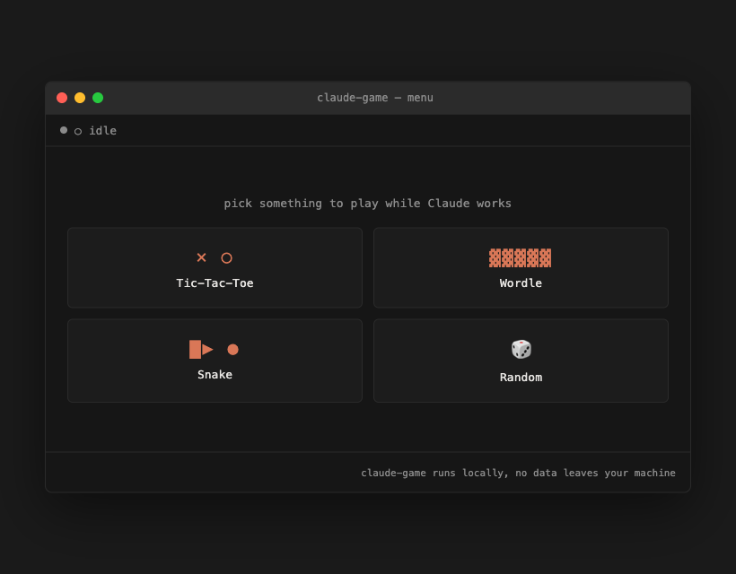
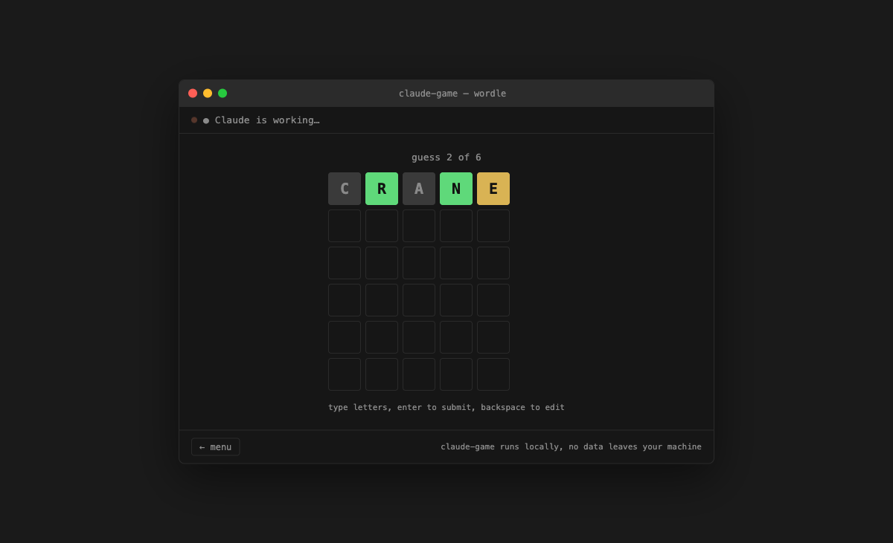

# claude-game

A tiny, dependency-free mini-game that pops up in your browser while
[Claude Code](https://claude.com/claude-code) is working, styled to look
like the Claude Code terminal. Play Tic-Tac-Toe, Wordle, or Snake instead
of watching a spinner — the page tells you the moment Claude's done and
gets out of the way.

> **This is an unofficial, community-built project.** It is not made,
> maintained, or endorsed by Anthropic. It just talks to Claude Code's
> public [hooks](https://code.claude.com/docs/en/hooks) system, the same
> way any other Claude Code hook script would.




## Features

- 🎮 Three games — Tic-Tac-Toe (vs. an unbeatable minimax AI), Wordle, and Snake
- 🟠 Styled to match the Claude Code terminal — dark theme, monospace, terminal chrome
- 🪶 Zero npm dependencies — plain Node `http` server, vanilla HTML/CSS/JS frontend
- 🔌 Works from any project — install once, hooks fire globally for every Claude Code session
- 🤝 Handles multiple concurrent Claude Code sessions safely (status only clears once *all* of them are done)
- 🔒 Runs entirely on `127.0.0.1` — nothing leaves your machine

## Requirements

- Node.js 18+
- macOS or Linux (Windows works under WSL or Git Bash — see [Troubleshooting](#troubleshooting))
- [Claude Code](https://claude.com/claude-code) installed and configured

## Install

```sh
git clone https://github.com/hariPrasadCoder/claude-game.git
cd claude-game
node install.js
```

`install.js`:
- Adds `UserPromptSubmit`, `Stop`, and `SessionEnd` hooks to `~/.claude/settings.json`, pointing at wherever you cloned the repo
- Backs up your existing `settings.json` first (`settings.json.bak-<timestamp>`)
- Only ever *adds* to your hooks config — it never touches your other settings, plugins, or existing hooks
- Is safe to re-run — it won't create duplicate entries

That's it. Start a Claude Code session anywhere on your machine and submit a prompt — a browser tab should open automatically.

## Usage

Just use Claude Code normally. When you submit a prompt, a tab opens (or an
existing one gets reused) showing a small terminal-styled menu:

- pick **Tic-Tac-Toe**, **Wordle**, or **Snake**, or hit **🎲 Random**
- the status line at the top shows `● Claude is working…` while Claude's
  on your prompt, and flips to `✔ Claude is done` the moment it finishes
  — without interrupting whatever you're mid-game on
- closing the tab is fine; it reopens next time you submit a prompt

## How it works

- `server.js` is a plain Node `http` server (no dependencies) that serves
  the game and tracks whether any Claude Code session is currently
  "working". It listens only on `127.0.0.1:47821`.
- The `UserPromptSubmit` hook makes sure the server is running (starting
  it as a detached background process if not) and opens a browser tab
  unless one already seems to be open (based on a recent heartbeat from
  the page).
- The `Stop` hook marks that session as done. **It never kills the
  server** — instead the server watches its own idle state and shuts
  itself down once nobody's working *and* no browser tab has sent a
  heartbeat in ~10 minutes. This means multiple concurrent Claude Code
  sessions (different terminals/projects) safely share one server without
  racing to kill it out from under each other — aggregate status only
  reads "done" once every tracked session has finished.
- The `SessionEnd` hook drops a session from the tracked set entirely
  when you exit `claude`.
- Runtime state (pidfile, logs) lives at `~/.claude-game/run/`, outside
  the repo, so it survives independent of where you cloned it.

See [`install.js`](install.js), [`server.js`](server.js), and the
[`hooks/`](hooks) directory for the actual implementation — it's short
and meant to be read.

## Configuration

Everything tunable lives in [`config.js`](config.js) — port, timeouts,
polling intervals. If you change the port, restart the server:

```sh
kill "$(cat ~/.claude-game/run/server.pid)"
```

It'll be respawned automatically on your next prompt.

## Uninstall

```sh
node uninstall.js
```

This removes claude-game's hook entries from `~/.claude/settings.json`
(backing the file up first) and leaves everything else untouched. To also
remove runtime state:

```sh
rm -rf ~/.claude-game
```

## Troubleshooting

**Nothing happens when I submit a prompt.**
Check `~/.claude-game/run/server.log` for errors. Confirm the hooks are
present: `cat ~/.claude/settings.json` should show a `hooks` key with
entries pointing at this repo's `hooks/` directory. Confirm `node` is on
your `PATH` — hook subprocesses sometimes inherit a minimal `PATH` that
doesn't include nvm/homebrew installs (see [`hooks/common-env.sh`](hooks/common-env.sh),
which tries to work around this).

**Port 47821 is already in use by something else.**
Change `PORT` in `config.js`, then kill any running instance
(`kill "$(cat ~/.claude-game/run/server.pid)"`) so it restarts with the
new port.

**Windows.**
The hook scripts are POSIX shell (`hooks/*.sh`) and assume a Unix-like
environment — they work under WSL or Git Bash, but not plain `cmd.exe`/
PowerShell today. A native Windows hook dispatcher (`.cmd` or PowerShell)
would be a welcome contribution — see [CONTRIBUTING.md](CONTRIBUTING.md).

**I want to see it working without touching real hooks.**
```sh
node server.js &
open http://127.0.0.1:47821/          # macOS
xdg-open http://127.0.0.1:47821/      # Linux

# simulate a hook call the way Claude Code does (JSON on stdin):
echo '{"session_id":"test-1","hook_event_name":"UserPromptSubmit"}' | node hooks/on-prompt-submit.js
echo '{"session_id":"test-1","hook_event_name":"Stop"}' | node hooks/on-stop.js
curl -s http://127.0.0.1:47821/api/status
```

## Contributing

Contributions are welcome — new games, a Windows-native hook dispatcher,
bug fixes, whatever. See [CONTRIBUTING.md](CONTRIBUTING.md) for how the
project is structured and how to add a game.

## License

[MIT](LICENSE)
